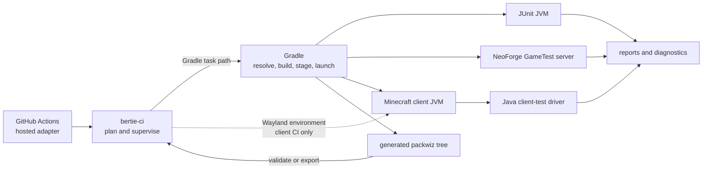
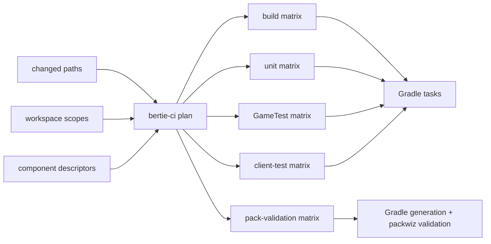
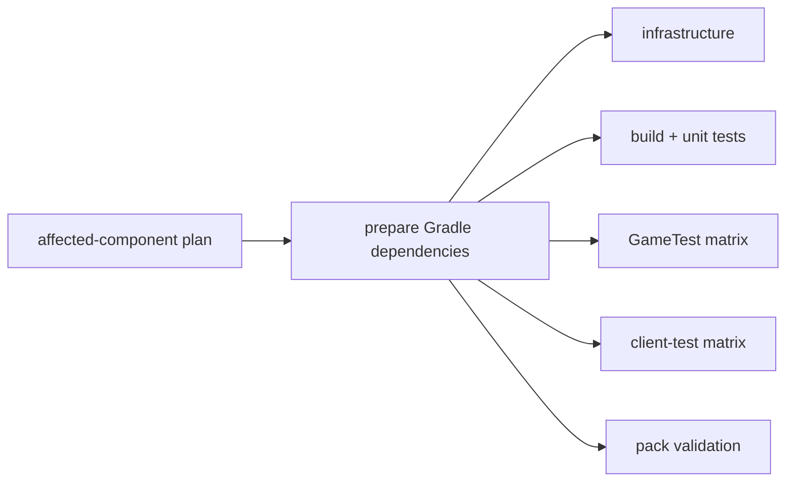
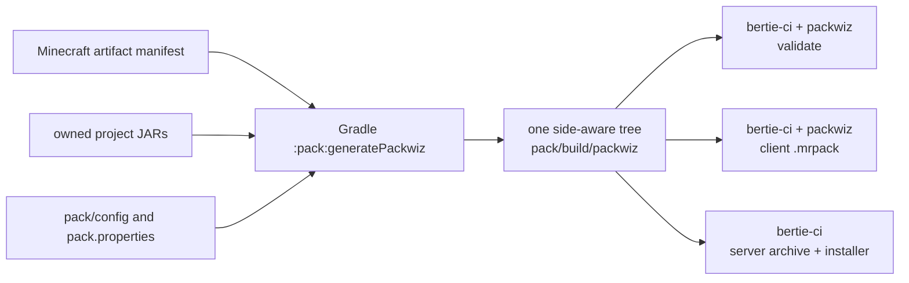

# CI/CD

Local commands and GitHub Actions invoke the same Gradle tasks. Gradle builds and launches
the projects. Java drivers run in-game tests. `bertie-ci` plans and supervises CI work.

## Development shell

Enter the pinned environment before running repository commands:

```bash
nix develop
```

Nix supplies JDK 21, Gradle, Python, packwiz, Sway, Mesa, and the GitHub tooling. The
repository has no Gradle wrapper and does not ask Gradle to download a Java toolchain.

Run the shared environment and workflow checks with:

```bash
nix flake check
gradle testInfrastructure
```

## What each tool does

| Component | Work |
| --- | --- |
| Gradle and `build-logic` | Resolve and verify dependencies, compile projects, stage isolated instances, launch test processes, publish reports, and generate the packwiz tree |
| Java test drivers | Discover in-game tests, coordinate Minecraft threads and lifecycle, manage client options and embedded servers, and write per-test results |
| `bertie-ci` | Discover components, plan affected tasks, supervise process groups and timeouts, provision CI Wayland, and run packwiz validation or exports |
| GitHub Actions | Supply hosted runners, pass plan entries to bertie-ci/Gradle, upload diagnostics, and publish releases |



CI does not maintain a second dependency graph, and Gradle does not configure Wayland or
invoke packwiz.

## Components and versions

The root [`bertie-ci.toml`](../bertie-ci.toml) discovers component descriptors and defines
which shared paths affect Gradle projects or every component. Each component descriptor
records its subject, kind, optional Gradle path, and version file:

```toml
format = "bertie-ci.component.v2"
subject = "example-mod"
kind = "neoforge-mod"
gradle-project = ":mods:example-mod"

[version]
file = "mod.properties"
key = "mod_version"
```

Each component reads its version from its own directory:

| Component kind | Version source |
| --- | --- |
| NeoForge mod | `mod.properties`, key `mod_version` |
| Pack | `pack.properties`, key `version` |
| bertie-ci tool | `pyproject.toml`, key `project.version` |

Source-set directories declare which test suites exist. Component descriptors do not
duplicate test lists, mod IDs, dependency sides, or Minecraft launch configuration.

## Change-based test planning

Inspect the same plan CI uses:

```bash
bertie-ci plan --workspace . --all
bertie-ci plan --workspace . --base origin/main --head HEAD
```

The plan has five matrices:

| Matrix | Work |
| --- | --- |
| `build` | Assemble affected owned mods |
| `unit` | Run affected `test` tasks |
| `gametest` | Run affected `runGameTests` tasks |
| `client` | Run affected `runClientTests` tasks |
| `validate` | Validate affected generated packs |

A changed component also selects its downstream dependents. Changes to shared Gradle or
testing infrastructure select every Gradle project; changes to repository-wide CI tooling
select every component. Paths matched by `ignored-paths`, including documentation and
licensing files, produce no plan entries. The patterns live in the root workspace
descriptor.



To reproduce one planned task with bertie-ci's timeout and log handling:

```bash
bertie-ci gradle-task --workspace . \
  --task :mods:bertie-tiers:runGameTests \
  --work-dir .bertie-ci/local/bertie-tiers \
  --timeout 1800
```

For local iteration, run the Gradle task directly.

## CI checks

The main [`check.yml`](../.github/workflows/check.yml) workflow runs on pull requests and
pushes to `main`:

1. Plan affected components from the Git range.
2. Resolve the repository's Gradle dependencies and prepare Minecraft artifacts and
   assets in one job.
3. Save the resulting isolated Gradle User Home cache under a hash of the dependency
   inputs.
4. Restore that exact cache in every build, unit-test, GameTest, client-test,
   infrastructure, and pack-validation job.
5. Run those jobs in parallel with Gradle's offline mode enabled.
6. Combine their outcomes into one required-check result.



`warmDependencies` resolves external configurations in every subproject, resolves the
included build's dependencies, and prepares the NeoForge/Minecraft artifacts and client
assets. CI sets `GRADLE_USER_HOME` to `.bertie-ci/gradle-user-home`; the runner's home
directory is not part of this cache. The warm-up is the workflow's only Gradle job allowed
to fetch dependencies. The jobs after it require the matching cache and `bertie-ci` adds
`--offline` to their Gradle commands.

Jobs upload JUnit reports, run directories, logs, crash reports, client screenshots, and
bertie-ci work directories for diagnosis. Matrix jobs use `fail-fast: false`, so one
component failure does not hide results from the others.

The [`full-pack.yml`](../.github/workflows/full-pack.yml) workflow runs nightly and on
manual dispatch. It uses the same dependency preparation job, then executes every suite
declared by `:pack` and validates the generated pack in parallel, independently of
change-based planning.

Mod and pack release builds use the same preparation and offline execution. Source-only
tool releases do not run Gradle.

Reusable unit, GameTest, client-test, and mod-build workflows are available to standalone
Bertie repositories through the tagged `bertie-ci` release. Their YAML delegates to the
same actions and commands used by this monorepo.

## Native Wayland in CI

Client-test Gradle tasks launch graphical Minecraft. Locally they inherit the current
desktop. For a Linux CI client matrix entry, the Gradle action asks `bertie-ci` for an
isolated native-Wayland session.

`bertie-ci` starts Sway on wlroots' headless backend with Xwayland disabled, provides a
Wayland-capable GLFW and software rendering, attaches a persistent virtual keyboard to
the Wayland seat, starts Gradle in that environment, and terminates its process group
afterward. Neither Gradle nor the Java driver contains display-backend policy.

## Pack validation and export

Pack validation and export start with Gradle generation:



Gradle generates the tree without executing packwiz. `bertie-ci` then invokes packwiz or
packages the generated files:

```bash
bertie-ci pack-validate --workspace . --component pack
bertie-ci pack-export-client --workspace . --component pack \
  --output .bertie-ci/release/bertie.mrpack
bertie-ci pack-export-server --workspace . --component pack \
  --output .bertie-ci/release/bertie-server.zip
```

Both exports use the generated side-aware tree. Owned JARs come from local Gradle project
outputs; publishing does not look up or compare separately released copies of owned mods.

## Releases

Each component has its own version and release tag. A release starts when an annotated,
SSH-signed tag in the exact form `<subject>/vX.Y.Z` is pushed:

```bash
git tag -s pack/v0.2.0 -m "Release pack v0.2.0"
git push origin pack/v0.2.0
```

Before tagging:

1. Update the component's local version metadata.
2. Run the component's required build and test pipelines for that commit.
3. Confirm that the tag subject matches its `bertie-ci.toml` subject and the tag version
   exactly matches the component metadata.

The release workflow validates the tag before doing any publishing:

- a mod release builds its JAR and publishes it to GitHub Releases;
- a pack release generates and publishes the client `.mrpack` and server `.zip`;
- a tool release publishes the tagged source release.

Never create a release by editing generated packwiz files or by substituting separately
published owned-mod JARs.

See [Dependencies](dependencies.md) for lock/checksum maintenance, [Testing](testing.md)
for suite authoring, and the [bertie-ci command reference](../tools/bertie-ci/README.md)
for CLI usage.
