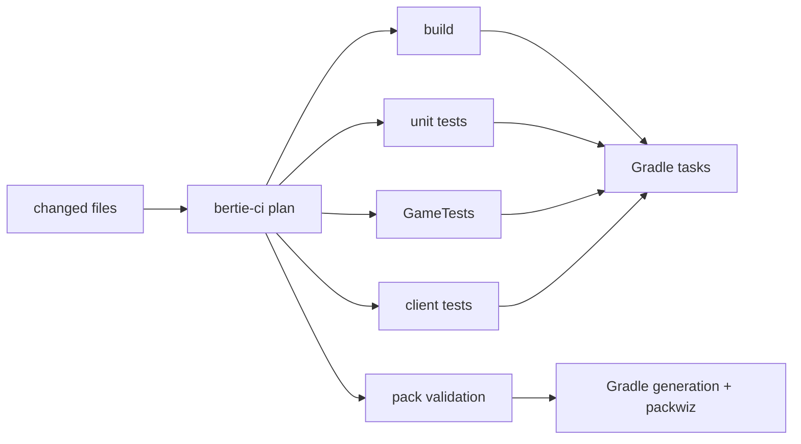
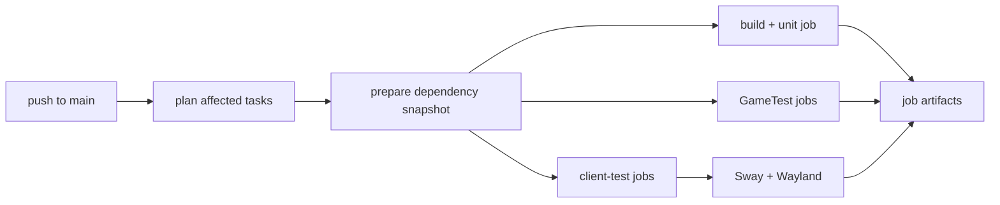

# CI, local checks, and releases

Run repository commands from the pinned development shell:

```bash
nix develop
```

The shell supplies Java 21, Gradle, Python, packwiz, Sway, Mesa, and the GitHub CLI. This
repository does not use a Gradle wrapper.

## Check a change locally

Start with the component you changed:

```bash
gradle :mods:bertie-tiers:test
gradle :mods:bertie-tiers:runGameTests
gradle :mods:bertie-tiers:runClientTests
```

Use `runTests` to run every suite enabled by one project:

```bash
gradle :mods:bertie-tiers:runTests
gradle :pack:runTests
```

Changes to shared Gradle, test-driver, Nix, or CI code should also run:

```bash
nix flake check
gradle testInfrastructure
```

See [Testing](testing.md) for the source-set and task conventions.

## Preview the CI plan

`bertie-ci` maps changed files to affected components and their Gradle tasks. Inspect the
plan before pushing a broad change:

```bash
bertie-ci plan --workspace . --base origin/main --head HEAD
```

To list every component task, regardless of changed files:

```bash
bertie-ci plan --workspace . --all
```

The plan contains `build`, `unit`, `gametest`, `client`, and `validate` lists. A change
to a component also selects components that depend on it. Shared paths are configured in
[`bertie-ci.toml`](../bertie-ci.toml).



Documentation, licensing files, and other ignored paths intentionally produce no
component tasks, so the check job finishes after planning.

## Reproduce a CI task

For fast local iteration, invoke Gradle directly. To reproduce CI timeout, process-group,
and log handling, use the exact task from the plan:

```bash
bertie-ci gradle-task --workspace . \
  --task :mods:bertie-tiers:runGameTests \
  --work-dir .bertie-ci/local/bertie-tiers \
  --timeout 1800
```

Client tests normally use the current desktop. On Linux, add `--wayland` to reproduce the
isolated native-Wayland session used by CI:

```bash
bertie-ci gradle-task --workspace . \
  --task :mods:short-circuit-fix:runClientTests \
  --work-dir .bertie-ci/local/short-circuit-fix \
  --timeout 1800 \
  --wayland
```

The Wayland run uses headless Sway with Xwayland disabled and software rendering. Gradle
still receives an ordinary graphical Minecraft task; `bertie-ci` starts and stops the
display session around it.

## GitHub checks

[`check.yml`](../.github/workflows/check.yml) runs after a push to `main`.
[`full-pack.yml`](../.github/workflows/full-pack.yml) runs nightly and can also be started
manually.



The preparation job calculates the plan, populates one immutable Gradle dependency cache
entry, and publishes its dependency snapshot. Once it completes, the build/unit job and
both test matrices start in parallel. Their Gradle invocations use `--offline`.

The build/unit job runs `testInfrastructure`, affected `assemble` and `test` tasks, and
pack generation in one Gradle invocation. It then validates generated packs. Each
affected `runGameTests` task gets a separate job, and each affected `runClientTests` task
gets a separate job with its own Sway session. Matrix jobs use `fail-fast: false`, so one
failing component does not stop other selected components.

All jobs set `GRADLE_USER_HOME` to `.bertie-ci/gradle-user-home`. The prepared dependency
cache contains downloaded modules, NeoForm Runtime artifacts, and game assets; its key is
derived from Gradle dependency inputs and is reused across workflow runs. The preparation
job publishes those directories as a one-day workflow artifact, and every execution job
downloads that exact snapshot before running Gradle offline. Nightly and release jobs use
the persistent cache directly because they do not fan out after preparation.

Each execution job also restores a platform- and task-specific work cache containing the
Gradle build cache and artifact transformations. A job may reuse the latest cache from
the same component or test kind. These entries improve later workflow runs; parallel
jobs do not exchange work-cache updates during the current run. Project `build`
directories and Minecraft instances are not cached.

The nightly full-pack workflow keeps the pack's build, GameTest, client-test, and
validation tasks in one job. It checks the combined pack outside the push workflow's
critical path.

Failed and successful jobs upload the useful parts of their work directories:

| Test kind | Reports and runtime data |
| --- | --- |
| Build and unit | Unit-test HTML/XML and the supervised Gradle log |
| GameTest | JUnit XML, Minecraft logs and crash reports, and the supervised Gradle log |
| Client | JUnit XML, screenshots, Minecraft logs and crash reports, the supervised Gradle log, and the Wayland log |

Worlds, staged mods, copied configuration, game assets, and other instance contents are
excluded. Every matrix entry has its own artifact named after the component.

## Add a component to CI

Every releasable component has a `bertie-ci.toml`. A NeoForge mod descriptor looks like:

```toml
format = "bertie-ci.component.v2"
subject = "example-mod"
kind = "neoforge-mod"
gradle-project = ":mods:example-mod"

[version]
file = "mod.properties"
key = "mod_version"
```

The root [`bertie-ci.toml`](../bertie-ci.toml) must discover the descriptor. Test tasks
are inferred from directories rather than listed in the descriptor:

| Directory | Planned task |
| --- | --- |
| `src/test` | `test` |
| `src/gametest` | `runGameTests` |
| `src/clienttest` | `runClientTests` |

The descriptor's `subject` is also used in release tags and artifact names. Keep the
version in the component's existing metadata: `mod.properties` for a mod,
and `pack.properties` for the pack.

## Validate and export the pack

Use the same commands locally and in release jobs:

```bash
bertie-ci pack-validate --workspace . --component pack
bertie-ci pack-export-client --workspace . --component pack \
  --output .bertie-ci/release/bertie.mrpack
bertie-ci pack-export-server --workspace . --component pack \
  --output .bertie-ci/release/bertie-server.zip
```

Each command runs `:pack:generatePackwiz` before invoking the required packwiz or archive
operation. See [Managing dependencies](dependencies.md) for changing the generated pack.

## Publish a release

1. Update the version in the component's `mod.properties` or `pack.properties`.
2. Run its tests and build or export commands on the release commit.
3. Create an annotated, SSH-signed `<subject>/vX.Y.Z` tag whose version exactly matches
   the metadata.
4. Push the tag.

For example:

```bash
git tag -s pack/v0.2.0 -m "Release pack v0.2.0"
git push origin pack/v0.2.0
```

[`release.yml`](../.github/workflows/release.yml) checks the tag and metadata before
publishing. Mod releases attach the built JAR to GitHub Releases. Pack releases attach a
client `.mrpack` and server `.zip`.

For all CLI options, see the [`bertie-ci` command reference](../tools/bertie-ci/README.md).
