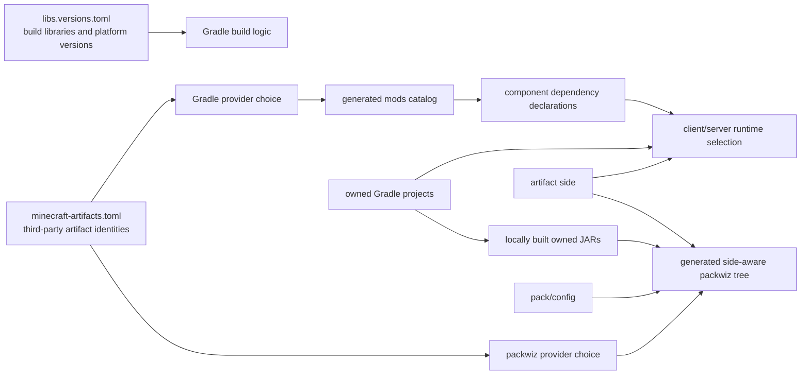

# Dependencies

Dependency metadata is split by dependency type.

## Metadata files

| Concern | Location |
| --- | --- |
| Java libraries, Gradle plugins, and shared platform versions | [`gradle/libs.versions.toml`](../gradle/libs.versions.toml) |
| Third-party Minecraft mods and shaderpacks | [`gradle/minecraft-artifacts.toml`](../gradle/minecraft-artifacts.toml) |
| Relationships between owned projects | The consuming project's `build.gradle.kts` |
| Owned mod identity and version | The mod's `mod.properties` |
| Pack identity and version | [`pack/pack.properties`](../pack/pack.properties) |

The Minecraft mod list is `minecraft-artifacts.toml`, not `libs.versions.toml`. During
Gradle settings evaluation, the artifact manifest produces a provider-neutral `mods`
version catalog for component build files.



## Third-party Minecraft artifacts

Each table in `minecraft-artifacts.toml` describes one logical artifact and groups every
provider record available for the selected release:

```toml
[mods.create]
maven = { module = "com.simibubi.create:create-1.21.1", version = "6.0.10-281" }
modrinth = { project-id = "LNytGWDc", version-id = "UjX6dr61", filename = "create-1.21.1-6.0.10.jar" }
curseforge = { slug = "create", project-id = 328085, file-id = 7963363 }
```

Provider records contain provider-native, immutable coordinates. Provider selection is
repository-wide:

| Consumer | Provider order |
| --- | --- |
| Gradle development and test runtimes | Maven, then Modrinth, then CurseForge |
| Generated packwiz metadata | Modrinth, then CurseForge |

Gradle uses an upstream Maven repository when one exists. Pack exports retain Modrinth or
CurseForge metadata. The manifest has no per-artifact `*-source` selectors.

The top-level table determines the destination:

- `[mods.<id>]` describes a mod JAR;
- `[shaderpacks.<id>]` describes a shaderpack archive.

Artifact IDs become aliases in the generated `mods` catalog. For example,
`slag-n-embers` is used as `mods.slagNEmbers`.

## Gradle dependencies

Component builds use Gradle configurations and the generated catalog:

```kotlin
dependencies {
    implementation(mods.create)
    compileOnly(mods.emi)

    clienttestRuntimeOnly(mods.emi)
}
```

Choose `implementation`, `compileOnly`, `runtimeOnly`, or a test-suite overlay according
to how the component uses the dependency. A configuration such as
`clienttestRuntimeOnly` means “needed by this suite”; it is not the declaration of the
artifact's physical side.

Owned mods are project dependencies:

```kotlin
dependencies {
    implementation(project(":mods:bertie-tiers"))
}
```

An owned mod's integrations stay in that mod. `mods/bertie-emi` is reserved for
integrations between Bertie and third-party mods.

## Physical sides

A third-party artifact may declare a lowercase `side`:

```toml
[mods.tweakerge]
side = "client"
modrinth = { project-id = "yke6wdGF", version-id = "701i2Xre", filename = "tweakerge-0.4.3+mc1.21.1.jar" }
curseforge = { slug = "tweakerge", project-id = 915857, file-id = 7971130 }
```

Allowed values are `client`, `server`, and `both`; omission means `both`. Build logic
uses this one field when constructing physical Minecraft runtimes:

| Context | Third-party artifacts |
| --- | --- |
| Compilation | All dependencies declared by the project |
| Unit tests | The declared test graph |
| Client runs and client tests | `client` and `both` |
| Dedicated-server runs and GameTests | `server` and `both` |
| Generated packwiz tree | All artifacts, with side-aware metafiles |

Do not reproduce this distinction with client/server dependency buckets in component
build files. Owned project artifacts are present on both physical sides; their NeoForge
entrypoints and mixins must load on each side. If an owned mod crashes a dedicated server,
fix the mod rather than classifying the project as client-only in the build.

The full-pack GameTest exercises the server projection. If a dependency marked `both`
exposes client code to a dedicated server, classify it as `client` when it is not part of
the server installation, or fix, replace, or remove it.

## Pack generation

The pack has source inputs, not checked-in packwiz metadata:

- `gradle/minecraft-artifacts.toml` supplies third-party artifacts;
- [`pack/build.gradle.kts`](../pack/build.gradle.kts) supplies owned project dependencies;
- [`pack/config`](../pack/config) supplies pack-owned installation files;
- [`pack/pack.properties`](../pack/pack.properties) supplies pack identity and version.

Run:

```bash
gradle :pack:generatePackwiz
```

Gradle writes one derived tree to `pack/build/packwiz`. Third-party artifacts become
side-aware provider metafiles. JARs built from owned projects are copied into the tree as
local files. Gradle does not invoke packwiz, and tests do not consume this output.

Do not check in generated `pack.toml`, `index.toml`, `.pw.toml` files, downloaded
artifacts, owned JARs, or Minecraft instances.

## Updating dependencies

For a third-party Minecraft artifact:

1. Identify the exact release on each available provider.
2. Add or update its logical table in `minecraft-artifacts.toml`.
3. Add `side` only when the artifact belongs on one physical side.
4. Use the generated `mods.<alias>` in each component that actually needs it.
5. Refresh locks and verification metadata.
6. Run the tests for each changed consumer.
7. If the artifact is part of the pack, run the pack tests or pack validation.

From `nix develop`, refresh the reproducibility data with:

```bash
gradle resolveAndLockAll resolveDependencyVerificationSeed \
  --write-locks --write-verification-metadata sha256
gradle -p build-logic resolveAndLockAll --write-locks
```

The first command covers the root build, including mods, testing projects, and the pack.
The second covers the included `build-logic` build. Review every changed coordinate and
checksum:

```bash
git diff -- '**/gradle.lockfile' '**/settings-gradle.lockfile' \
  gradle/verification-metadata.xml
```

Checks:

```bash
gradle testInfrastructure test
bertie-ci pack-validate --workspace . --component pack
```

See [Testing](testing.md) for choosing Minecraft suites and [CI/CD](cicd.md) for pack
exports and release tags.
