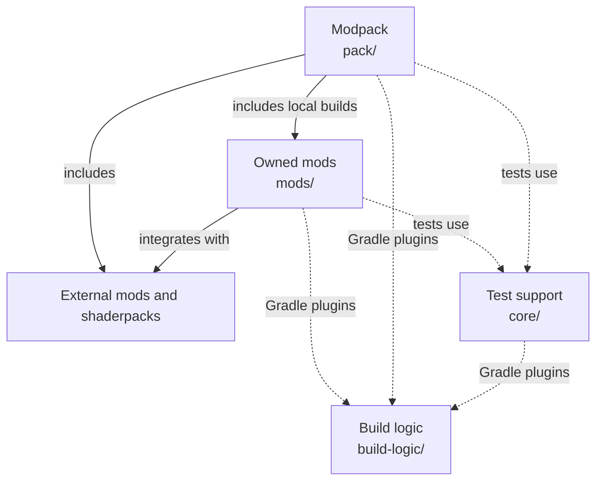
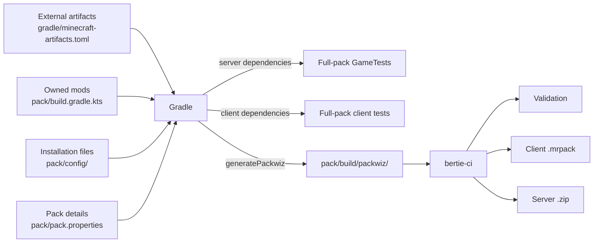

# Repository overview

This page explains how the repository is split, how the pack is assembled, and how the
build and CI pieces fit together. For a mod's behavior and internal design, read that
mod's `README.md`.

## Overview

Solid arrows below are code or pack dependencies. Dotted arrows are build or test
support. Arrows point from the consumer to what it uses.

## Layout

| Path | Contains |
| --- | --- |
| [`mods/`](../mods) | Owned mods, each with its own code, resources, tests, version, licence, and release |
| [`pack/`](../pack) | The mod selection, installation configuration, full-pack tests, and client/server exports |
| [`core/`](../core) | Shared Minecraft downloads and reusable GameTest and client-test support |
| [`build-logic/`](../build-logic) | Gradle plugins and tasks shared by the other projects |
| [`gradle/`](../gradle) | Shared versions, external Minecraft artifacts, locks, and checksums |
| [`tools/bertie-ci/`](../tools/bertie-ci) | CI planning, process supervision, diagnostics, Wayland setup, and release packaging |
| [`.github/`](../.github) | Workflow triggers, caches, artifact uploads, and release publication |
| [`flake.nix`](../flake.nix) and [`flake.lock`](../flake.lock) | The development and CI tools supplied by Nix |

## Dependency rules

- Keep behavior owned by one mod in that mod. Use `pack/` for composition,
  installation configuration, and tests that require the complete modpack.
- `pack/` may depend on owned mods; owned mods must not depend on `pack/`.
- Mods may use external mods and libraries. An owned-mod dependency must be an explicit
  Gradle project dependency; do not assume another owned mod is available through the
  full-pack classpath.
- `core/` must not depend on product mods or `pack/`.
- Keep tests with the component they test. Put reusable in-game test code in `core/`.
- Keep shared Gradle behavior in `build-logic/`. Keep task selection, supervision, and
  packaging in `bertie-ci`. Workflow YAML should only connect those tools to GitHub.
- Do not commit generated packwiz files, downloaded dependencies, Minecraft instances,
  test reports, or release archives.

Owned mods are versioned and released separately. The pack does not download those
releases: it packages the owned-mod JARs built from the same checkout.

No owned mod currently depends on another owned mod. If one does, declare the project
dependency in the consumer's `build.gradle.kts` and add the matching `depends-on` entry
to its `bertie-ci.toml` so CI also follows the dependency.

## Build inputs

| To change | Edit |
| --- | --- |
| Included Gradle projects | [`settings.gradle.kts`](../settings.gradle.kts) |
| Java libraries, Gradle plugins, Minecraft, or NeoForge versions | [`gradle/libs.versions.toml`](../gradle/libs.versions.toml) |
| External mods, datapacks, resourcepacks, shaderpacks, download providers, or physical sides | [`gradle/minecraft-artifacts.toml`](../gradle/minecraft-artifacts.toml) |
| An owned mod's identity or version | That mod's `mod.properties` |
| Owned mods included in the pack | [`pack/build.gradle.kts`](../pack/build.gradle.kts) |
| Pack identity or version | [`pack/pack.properties`](../pack/pack.properties) |
| Files installed with the pack | [`pack/config/`](../pack/config) |
| Locked dependencies or checksums | Component lock files and [`gradle/verification-metadata.xml`](../gradle/verification-metadata.xml) |
| CI components or shared affected paths | Root [`bertie-ci.toml`](../bertie-ci.toml) and component `bertie-ci.toml` files |
| Development or CI tools | [`flake.nix`](../flake.nix) and [`flake.lock`](../flake.lock) |

See [Managing dependencies](dependencies.md) for updating locks, checksums, and pack
dependencies.

## Shared test support

`core/` contains four Gradle projects:

| Project | Purpose |
| --- | --- |
| `core/minecraft` | Downloads Minecraft files, assets, tools, and platform-native libraries for offline jobs |
| `core/client-test-api` | Provides `@ClientTest` and the context, input, world, server, and connection APIs used by tests |
| `core/client-test-driver` | Finds and runs client tests, manages client/server work and test worlds, and writes results and diagnostics |
| `core/gametest-driver` | Adds an XML report to the NeoForge GameTest runner |

`core/client-test-driver` depends on `core/client-test-api`. The `bertie.client-test`
Gradle plugin adds the API at compile time and the driver at runtime. The
`bertie.gametest` plugin adds the GameTest driver at runtime. Components only need to
apply the plugin for the suite they use.

See [Writing and running tests](testing.md) for choosing and running a test suite.

## Pack build

The settings plugin turns `minecraft-artifacts.toml` into the `mods` version catalog
used by component build files. The pack plugin adds every external pack artifact and the
owned projects listed in `pack/build.gradle.kts`.

External artifacts may be marked `client`, `server`, or `both`. Full-pack GameTests use
the server set, and client tests use the client set. Owned mods are installed on both
sides and must load safely on both.

Tests resolve their dependencies directly with Gradle; they do not use the generated
packwiz directory. `generatePackwiz` writes third-party metadata, locally built owned-mod
JARs, pack details, and installation files under `pack/build/packwiz`. `bertie-ci` checks
that directory or turns it into the two release archives.

See [Pack maintenance and installation](../pack/README.md) for pack and export details.

## Build and CI

Developers run Gradle tasks directly. GitHub Actions calls `bertie-ci`, which selects
affected components, runs the same Gradle tasks with timeouts and logging, and packages
release files. Gradle still decides how projects are built and tested.

The root `bertie-ci.toml` lists component descriptors and repository-wide paths. Each
owned mod and the pack has a descriptor containing its Gradle project and version file.
The presence of `src/test`, `src/gametest`, or `src/clienttest` selects the matching test
task.

A mod change selects that mod and the pack. Changes under `build-logic/`, `core/`, or
shared Gradle files select every Gradle component. Changes to `bertie-ci` or the main CI
workflows select every releasable component.

See [CI and releases](cicd.md) for local checks, CI plans, failure diagnosis, exports,
and releases.

## Where to make a change

| Change | Location |
| --- | --- |
| One mod's behavior, resources, configuration, or tests | That project under `mods/` |
| Mod selection, installation files, or a test needing the full pack | `pack/` |
| APIs used to write client tests | `core/client-test-api` |
| Client-test execution, worlds, input, results, or diagnostics | `core/client-test-driver` |
| Shared GameTest reporting | `core/gametest-driver` |
| Minecraft files prepared for offline jobs | `core/minecraft` |
| Shared Gradle behavior or repository build tasks | `build-logic/` |
| Shared dependencies or platform versions | `gradle/` and the relevant lock or checksum file |
| CI planning, process handling, Wayland support, or packaging | `tools/bertie-ci/` |
| Workflow triggers, caches, uploads, or GitHub releases | `.github/` |
| Development or CI tool versions | `flake.nix` and `flake.lock` |
| Repository-wide instructions | `docs/` |

When adding a releasable component, include its Gradle project in `settings.gradle.kts`,
add its metadata, README, and `bertie-ci.toml`, and add an owned mod to
`pack/build.gradle.kts` if it belongs in the full pack. The [CI guide](cicd.md) documents
the component descriptor.
