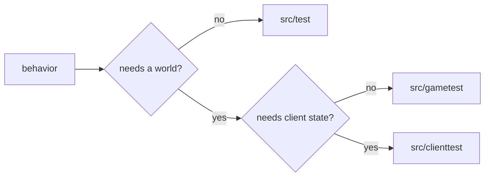

# Writing and running tests

Put a test in the project that owns the behavior. Use `pack/src` only when the assertion
needs the complete modpack.

## Choose a suite

| Source directory | Use it for | Task |
| --- | --- | --- |
| `src/test` | Java behavior that does not need a ticking world or client | `test` |
| `src/gametest` | Registries, data packs, recipes, blocks, entities, events, structures, and logical-server behavior | `runGameTests` |
| `src/clienttest` | Screens, input, resources, rendering, client integrations, singleplayer, and connected-client behavior | `runClientTests` |



## Configure and run suites

Apply the plugin for every source directory the project contains:

```kotlin
plugins {
    id("bertie.mod")
    id("bertie.neoforge-test")
    id("bertie.gametest")
    id("bertie.client-test")
}
```

`bertie.mod` enables ordinary JUnit 5 tests. Add `bertie.neoforge-test` when JUnit needs
FML initialization or NeoForge transformations. The other two plugins enable their
matching Minecraft suites.

Run one suite or all suites in a project:

```bash
gradle :mods:berlords-carving:test
gradle :mods:berlords-carving:runGameTests
gradle :mods:berlords-carving:runClientTests
gradle :mods:berlords-carving:runTests
```

Run shared Gradle and test-library tests with:

```bash
gradle testInfrastructure
```

## JUnit

Prefer `src/test` when no ticking world is required. It starts faster and uses Gradle's
normal JUnit report.

Declare optional test dependencies in the matching test configuration:

```kotlin
dependencies {
    testImplementation(mods.exampleApi)
    testRuntimeOnly(mods.exampleRuntime)
}
```

Move the test to `src/gametest` or `src/clienttest` when it needs world ticks, networking,
rendering, or input.

## GameTests

GameTests use NeoForge's `@GameTestHolder` and the vanilla GameTest annotations:

```java
@GameTestHolder("examplemod")
public final class ExampleGameTests {
    @GameTest(template = "empty", timeoutTicks = 200)
    public static void machineProcessesInput(GameTestHelper helper) {
        // Arrange blocks and assert server-visible behavior.
        helper.succeed();
    }
}
```

Put structure templates under the test resources:

```text
src/gametest/resources/data/examplemod/structure/empty.nbt
```

Use `@GameTestGenerator` to generate several cases. `runGameTests` runs them on a NeoForge
dedicated server. See [Berlord's Carving GameTests](../mods/berlords-carving/src/gametest/java/io/github/bertie_mc/carving/gametest/CarvingGameTests.java)
for a working example.

## Client tests

A client test is a public static method annotated with `@ClientTest`:

```java
public final class ExampleClientTests {
    @ClientTest
    public static void opensExpectedScreen(ClientTestContext context) {
        context.setScreen(ExampleScreen::new);
        context.waitForScreen(ExampleScreen.class);
        context.clickScreenButton("example.action.confirm");
    }
}
```

[`ClientTestContext`](../core/client-test-api/src/main/java/io/github/bertie_mc/testing/client/ClientTestContext.java)
provides render-thread execution, state waits, screen interaction, input, worlds, servers,
screenshots, and option reset. Use its `worldBuilder()` when a test needs a connected
world.

For an integrated world:

```java
try (var world = context.worldBuilder().create()) {
    world.connection().waitForChunksRender();
    world.server().runCommand("time set noon");
    context.runOnClient(client -> {
        // Assert client-visible state.
    });
}
```

For a dedicated server connection:

```java
try (var server = context.worldBuilder().createServer()) {
    try (var connection = server.connect()) {
        connection.waitForChunksRender();
        server.runOnServer(minecraftServer -> {
            // Assert server state.
        });
    }
}
```

See the [Carving EMI client test](../mods/berlords-carving/src/clienttest/java/io/github/bertie_mc/carving/test/CarvingEmiClientTests.java)
for an integrated-world example.

## Full-pack tests

The `:pack` project uses the same source directories and tasks. Add a pack test only when
it needs pack startup, pack configuration, or several mods together:

```bash
gradle :pack:test
gradle :pack:runGameTests
gradle :pack:runClientTests
gradle :pack:runTests
```

Pack tests use the Gradle dependencies directly; generating the packwiz output is not
part of a test run.

## Client displays

On a developer machine, client tests use the current desktop. To reproduce CI's isolated
Wayland environment on Linux:

```bash
bertie-ci gradle-task --workspace . \
  --task :pack:runClientTests \
  --work-dir .bertie-ci/local/pack-client \
  --timeout 3600 \
  --wayland
```

## Diagnose a failure

| Output | Location |
| --- | --- |
| JUnit unit tests | `build/test-results/test` and `build/reports/tests/test` |
| GameTest result | `build/test-results/gametest/TEST-gametest.xml` |
| Client-test result | `build/test-results/clienttest/TEST-clienttest.xml` |
| Client screenshots | `build/test-diagnostics/clienttest` |
| Minecraft logs and crashes | `build/minecraft-runs/<suite>/logs` and `build/minecraft-runs/<suite>/crash-reports` |
| Supervised Gradle log | The `--work-dir` passed to `bertie-ci gradle-task` |

Start with the JUnit failure, then inspect the Minecraft log or crash report from the same
time. CI uploads these files with the failed job.

Wait on observable state instead of sleeping for a fixed duration. Close worlds, servers,
and connections with try-with-resources. Remove or rewrite tests that no longer assert
useful behavior.

See [Managing dependencies](dependencies.md) for test dependencies and
[CI and releases](cicd.md) for affected checks.
