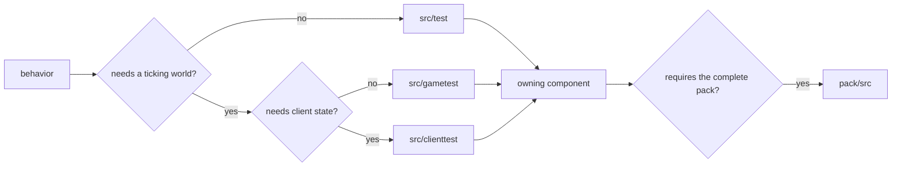
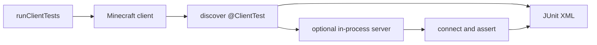

# Writing and running tests

Bertie projects use JUnit, vanilla GameTests, and client tests. Put the test in the
component that implements the behavior. Use `pack/src/...` only when the assertion needs
the complete modpack.

## Choose a suite

| Source directory | Use it for | Gradle task |
| --- | --- | --- |
| `src/test` | Pure Java behavior, parsing, serialization, validation, and small loader-aware tests | `test` |
| `src/gametest` | Registries, recipes, blocks, entities, structures, events, data packs, and logical-server world behavior | `runGameTests` |
| `src/clienttest` | Screens, input, resources, rendering, client integrations, singleplayer, and networked client behavior | `runClientTests` |



## Enable suites in a project

Apply the plugin for each source directory the project contains:

```kotlin
plugins {
    id("bertie.mod")
    id("bertie.neoforge-test")
    id("bertie.gametest")
    id("bertie.client-test")
}
```

`bertie.mod` configures ordinary JUnit 5 tests. Add `bertie.neoforge-test` when a JUnit
test needs FML initialization or NeoForge transformations. `bertie.gametest` and
`bertie.client-test` add their source sets, test carrier mods, Minecraft runs, and reports.

A mod may therefore contain:

```text
mods/example/
  src/main/
  src/test/
  src/gametest/
  src/clienttest/
```

Test carrier mods are build output and are not included in the production mod JAR.

Run one suite or all suites enabled by a project:

```bash
gradle :mods:berlords-carving:test
gradle :mods:berlords-carving:runGameTests
gradle :mods:berlords-carving:runClientTests
gradle :mods:berlords-carving:runTests
```

Run shared build-logic and test-driver tests with:

```bash
gradle testInfrastructure
```

## JUnit tests

Use `src/test` whenever the assertion does not need a ticking Minecraft world. This keeps
the feedback loop short and makes failures available through the normal Gradle test
report.

If the test imports an optional third-party mod, add that dependency to the appropriate
test configuration:

```kotlin
dependencies {
    testImplementation(mods.exampleApi)
    testRuntimeOnly(mods.exampleRuntime)
}
```

Move the test to `src/gametest` or `src/clienttest` once it needs lifecycle, world ticks,
networking, rendering, or input.

## GameTests

GameTests use NeoForge's `@GameTestHolder` and the vanilla GameTest annotations:

```java
@GameTestHolder("examplemod")
public final class ExampleGameTests {
    @GameTest(template = "empty", timeoutTicks = 200)
    public static void machineProcessesInput(GameTestHelper helper) {
        // Place blocks, advance the test, and inspect server-visible state.
        helper.succeed();
    }
}
```

Add structure templates to the GameTest resources:

```text
src/gametest/resources/data/examplemod/structure/empty.nbt
```

Use `@GameTestGenerator` when one method needs to generate several tests. The normal
NeoForge and vanilla annotations handle discovery; no extra entrypoint file is needed.

`runGameTests` starts a NeoForge dedicated server and writes the vanilla runner results as
JUnit XML. Dependencies marked `client` in `gradle/minecraft-artifacts.toml` are absent
from this run.

See [Berlord's Carving GameTests](../mods/berlords-carving/src/gametest/java/io/github/bertie_mc/carving/gametest/CarvingGameTests.java)
for a working example.

## Client tests

A client test is a public static method annotated with `@ClientTest`:

```java
public final class ExampleClientTests {
    @ClientTest
    public static void opensExpectedScreen(ClientTestContext context) {
        context.setScreen(ExampleScreen::new);
        context.waitForScreen(ExampleScreen.class);
        context.clickScreenButton("example.action.confirm");
    }
}
```

The driver discovers annotated methods on the test carrier mod. `ClientTestContext`
provides these groups of operations:

| API | Use |
| --- | --- |
| `runOnClient`, `computeOnClient` | Read or mutate state on the render thread |
| `waitTick`, `waitTicks`, `waitFor` | Wait for game state without sleeping the process |
| `setScreen`, `waitForScreen`, `clickScreenButton` | Open screens and interact with translated buttons |
| `input()` | Keyboard, mouse, cursor, text, and scroll input through Minecraft handlers |
| `worldBuilder()` | Create an integrated world or an in-process dedicated server |
| `takeScreenshot` | Save a named diagnostic image |
| `restoreDefaultGameOptions` | Reset options changed by the current test |

The driver restores its captured game-option defaults before each test. A test can call
`restoreDefaultGameOptions()` again after changing options.

### Integrated worlds

Create an integrated world as a scoped resource:

```java
try (var world = context.worldBuilder().create()) {
    world.connection().waitForChunksRender();
    world.server().runCommand("time set noon");
    context.runOnClient(client -> {
        // Assert client-visible state.
    });
}
```

The [Carving EMI client test](../mods/berlords-carving/src/clienttest/java/io/github/bertie_mc/carving/test/CarvingEmiClientTests.java)
is an integrated-world example.

### Dedicated servers

A client test can create and connect to a dedicated server inside the client process:

```java
try (var server = context.worldBuilder().createServer()) {
    try (var connection = server.connect()) {
        connection.waitForChunksRender();
        server.runOnServer(minecraftServer -> {
            // Inspect dedicated-server state.
        });
        context.runOnClient(client -> {
            // Inspect the connected client.
        });
    }
}
```

Closing the connection and server stops their networking and server lifecycle. Gradle
launches the client test process; the Java driver creates the server when the test asks
for it.



Use a GameTest when the assertion requires a separate `Dist.DEDICATED_SERVER` process.

### Extending the client-test API

The client API takes design cues from Fabric API 26.2's screen, input, option, world, and
dedicated-server helpers. When adding an operation, compare the relevant Fabric behavior
before inventing another calling convention:

- [`ClientGameTestContext`](https://github.com/FabricMC/fabric-api/blob/26.2/fabric-client-gametest-api-v1/src/client/java/net/fabricmc/fabric/api/client/gametest/v1/context/ClientGameTestContext.java)
- [`ClientGameTestContextImpl`](https://github.com/FabricMC/fabric-api/blob/26.2/fabric-client-gametest-api-v1/src/client/java/net/fabricmc/fabric/impl/client/gametest/context/ClientGameTestContextImpl.java)
- [`DedicatedServerImplUtil`](https://github.com/FabricMC/fabric-api/blob/26.2/fabric-client-gametest-api-v1/src/client/java/net/fabricmc/fabric/impl/client/gametest/util/DedicatedServerImplUtil.java)

Fabric is a reference for the test API, not a Bertie runtime dependency.

## Full-pack tests

The `:pack` project uses the same three source directories. Put a test there only when it
needs pack startup, pack configuration, or several mods together:

```bash
gradle :pack:test
gradle :pack:runGameTests
gradle :pack:runClientTests
gradle :pack:runTests
```

Pack tests resolve the declared runtime dependencies directly through Gradle. Generating
or installing the packwiz pack is not part of a test run.

## Client displays

On a developer desktop, `runClientTests` uses the current graphical session. It works on
Wayland or X11 according to the installed environment and GLFW selection.

Linux CI runs the same Gradle task through an isolated native-Wayland Sway session. To
reproduce that environment locally:

```bash
bertie-ci gradle-task --workspace . \
  --task :pack:runClientTests \
  --work-dir .bertie-ci/local/pack-client \
  --timeout 3600 \
  --wayland
```

The main CI job passes every affected task to one Gradle invocation. Gradle runs ordinary
build and JUnit work in parallel and schedules one Minecraft test process at a time.
When any client task is selected, `bertie-ci` keeps one Wayland session around the whole
Gradle invocation.

## Reports and failure files

| Output | Location |
| --- | --- |
| GameTest JUnit XML | `build/test-results/gametest/TEST-gametest.xml` |
| Client-test JUnit XML | `build/test-results/clienttest/TEST-clienttest.xml` |
| Client screenshots and diagnostics | `build/test-diagnostics/clienttest` |
| Minecraft logs, worlds, and crash reports | `build/minecraft-runs` |
| Supervised Gradle log | The `--work-dir` passed to `bertie-ci gradle-task` |

CI uploads these directories even when the task graph fails. Prefer the JUnit failure first,
then inspect the Minecraft log and crash report around the same timestamp.

Use state predicates instead of fixed sleeps, and close worlds, servers, and connections
with try-with-resources. Remove or rewrite tests that no longer assert a useful behavior;
preserving the number of tests is not a goal.

See [Managing dependencies](dependencies.md) for test dependencies and [CI/CD](cicd.md)
for affected-task planning and the combined GitHub job artifact.
