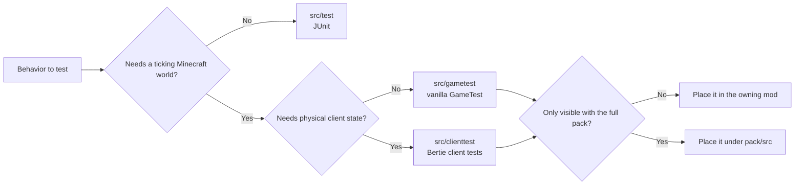
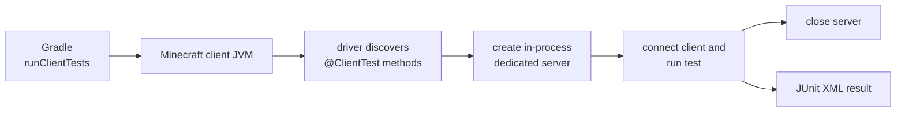

# Testing

Bertie tests use three source sets. Select one based on the required Minecraft runtime.
The pack uses the same runners as the mods.

## Test types

| Source set | Runner | Use it for |
| --- | --- | --- |
| `src/test` | JUnit 5 | Pure Java behavior, parsing, validation, serialization, and small loader-aware contracts |
| `src/gametest` | Vanilla GameTest on a NeoForge dedicated server | Registries, recipes, blocks, entities, structures, events, data packs, and logical-server world behavior |
| `src/clienttest` | Bertie client-test driver in a NeoForge client | Screens, input, resources, rendering, client integrations, singleplayer, and networked client behavior |



Put each test in the component that implements the tested behavior. Use `pack/src/...`
only for startup, configuration, or cross-mod contracts that require the full pack
inventory.

## Source sets and Gradle tasks

Apply a convention plugin for each test source set:

```kotlin
plugins {
    id("bertie.neoforge-mod")
    id("bertie.neoforge-unit-test")
    id("bertie.gametest")
    id("bertie.client-test")
}
```

Source layout:

```text
mods/<component>/
  src/main
  src/test
  src/gametest
  src/clienttest

pack/
  src/test
  src/gametest
  src/clienttest
```

Test code is packaged as a test-only NeoForge carrier mod. It is not included in the
production mod JAR.

| Gradle task | Result |
| --- | --- |
| `test` | Runs the project's JUnit suite |
| `runGameTests` | Starts the project's NeoForge GameTest server |
| `runClientTests` | Starts one Minecraft client and runs annotated client tests |
| `runTests` | Aggregates the suites enabled by that project |
| `testInfrastructure` | Tests shared build logic and the reusable test APIs/drivers |

Run tasks by project path:

```bash
gradle :mods:berlords-carving:test
gradle :mods:berlords-carving:runGameTests
gradle :mods:berlords-carving:runClientTests
gradle :pack:runTests
```

## Unit tests

Use JUnit when the contract does not require a live world or physical client. This covers
algorithms, mappings, parsers, resource formats, and isolated mod behavior.
`bertie.neoforge-unit-test` enables NeoForge class transformation for tests that load
Minecraft or transformed mod classes.

Do not start Minecraft for a contract that a JVM test can cover.

## GameTests

GameTests use the vanilla framework and NeoForge's class-level holder annotation:

```java
@GameTestHolder("examplemod")
public final class ExampleGameTests {
    @GameTest(template = "empty", timeoutTicks = 200)
    public static void machineProcessesInput(GameTestHelper helper) {
        // Arrange blocks and entities through the helper.
        // Assert observable world behavior.
        helper.succeed();
    }
}
```

`@GameTestHolder`, `@GameTest`, and `@GameTestGenerator` are the discovery mechanism.
There is no Bertie entrypoint file or parallel registry. Structure templates live under
the suite's resources, for example:

```text
src/gametest/resources/data/examplemod/structure/empty.nbt
```

Gradle starts a physical dedicated-server process with the project's server dependency
projection (`server` plus `both`). The reporting bridge collects results from the vanilla
GameTest runner and writes JUnit XML.

Use GameTests for logical server and world behavior even when that behavior can also be
triggered from an interactive client with `/test`. Their dedicated-server process also
catches accidental client linkage.

See [Berlord's Carving GameTests](../mods/berlords-carving/src/gametest/java/io/github/bertie_mc/carving/gametest/CarvingGameTests.java)
for an example.

## Client tests

A client test is a public static method marked with `@ClientTest`:

```java
public final class ExampleClientTests {
    @ClientTest
    public static void opensExpectedScreen(ClientTestContext context) {
        context.setScreen(ExampleScreen::new);
        context.waitForScreen(ExampleScreen.class);
        context.clickScreenButton("example.action.confirm");
    }
}
```

`@ClientTest` is the only discovery declaration. There is no holder annotation, entrypoint
list, generated method registry, or descriptor file.

`ClientTestContext` provides operations for Minecraft's thread and tick model:

- `runOnClient` and `computeOnClient` for render-thread work;
- tick waits and state-oriented `waitFor` methods;
- `setScreen`, `waitForScreen`, and translated-button helpers;
- Minecraft-window keyboard and mouse input through `input()`;
- integrated and dedicated worlds through `worldBuilder()`;
- screenshots and failure diagnostics.

The driver captures game-option defaults after mod loading and restores them before each
test. A test that changes options can call `restoreDefaultGameOptions()` itself. Gradle
does not generate `options.txt` or decide Minecraft client settings.

### Worlds and connections

Worlds, connections, and servers are scoped resources:

```java
try (var server = context.worldBuilder().createServer()) {
    try (var connection = server.connect()) {
        connection.waitForChunksRender();
        context.runOnClient(client -> {
            // Assert client-visible networked behavior.
        });
    }
}
```

The Java driver creates the dedicated server inside the client JVM, waits for readiness,
connects through Minecraft networking, and stops the server when its context closes.
Gradle launches only the client process; it does not provision a companion server task or
endpoint.



The in-process server is a `MinecraftServer` inside a `Dist.CLIENT` process, so it uses the
client dependency projection. Use GameTests for loading and behavior in a physical
dedicated-server environment.

See [the Carving EMI client test](../mods/berlords-carving/src/clienttest/java/io/github/bertie_mc/carving/test/CarvingEmiClientTests.java)
for an integrated-world example.

## Full-pack integration

The `:pack` project runs GameTests and client tests with the pack's dependency inventory:

- `:pack:runGameTests` uses the physical server projection and verifies pack startup plus
  server or cross-mod contracts;
- `:pack:runClientTests` uses the client projection and verifies resources, client
  integrations, and client-visible dedicated-server behavior;
- component behavior remains in component suites instead of being copied into the pack.

Tests resolve dependencies directly through Gradle. They do not build or install the
generated packwiz tree.

## Local desktops and CI Wayland

Client-test tasks launch graphical Minecraft. Locally, Gradle inherits the current desktop
and imposes no display-backend requirement.

In Linux CI, `bertie-ci` starts an isolated native-Wayland Sway session with Xwayland
disabled, supplies software rendering and a Wayland-capable GLFW, runs the same Gradle
task, and tears the session down. Gradle and the Java driver receive that environment;
neither configures the display backend.

## Results and diagnostics

Minecraft suites write JUnit XML under the owning project:

```text
build/test-results/gametest/TEST-gametest.xml
build/test-results/clienttest/TEST-clienttest.xml
```

Client screenshots and other failure artifacts are written under
`build/test-diagnostics/clienttest`. Run directories, worlds, logs, and crash reports stay
under `build/runs`. Gradle fails a task when the game exits unsuccessfully, a report is
missing or invalid, or a test reports a failure.

In CI, these files and the corresponding bertie-ci work directory are uploaded as job
artifacts.

## Writing tests

- Assert an observable contract, not the implementation path used to reach it.
- Keep a test in the component that owns the behavior.
- Wait for a named state predicate instead of sleeping for a fixed duration.
- Close worlds, servers, and connections with try-with-resources.
- Rewrite, move, combine, or remove brittle and wrongly layered tests; preserving an
  assertion count is not a goal.
- Add pack coverage only when the behavior depends on the full installation.

The client API is inspired by Fabric API 26.2's client GameTest contexts, input helpers,
live option handling, and in-process dedicated-server lifecycle. Fabric is a design
reference, not a runtime dependency or compatibility target. Developers extending the
driver can refer to Fabric's
[`ClientGameTestContext`](https://github.com/FabricMC/fabric-api/blob/26.2/fabric-client-gametest-api-v1/src/client/java/net/fabricmc/fabric/api/client/gametest/v1/context/ClientGameTestContext.java)
and
[`DedicatedServerImplUtil`](https://github.com/FabricMC/fabric-api/blob/26.2/fabric-client-gametest-api-v1/src/client/java/net/fabricmc/fabric/impl/client/gametest/util/DedicatedServerImplUtil.java).

See [Dependencies](dependencies.md) for runtime projection rules and [CI/CD](cicd.md) for
planning, Wayland supervision, and uploaded reports.
