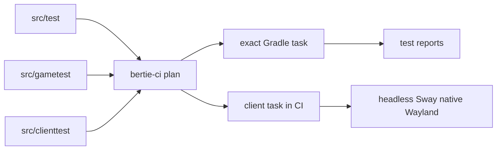

# bertie-ci

`bertie-ci` turns the repository's component inventory and conventional test source
sets into a CI plan. Gradle owns building and running tests; `bertie-ci` supervises the
planned tasks, provides an isolated Wayland compositor when CI asks for one, and keeps
pack/release packaging independent from testing.



## Environment

From the monorepo:

```bash
nix develop
bertie-ci --help
nix flake check
```

Nix supplies JDK 21, Gradle, packwiz, Sway, Mesa, and Python.

Native Windows can use an installed Python package plus JDK 21 and Gradle; see the
[Windows guide](docs/windows.md).

## Descriptors and discovery

The root [workspace descriptor](../../bertie-ci.toml) locates components and declares
which shared paths affect Gradle projects or every component.

```toml
format = "bertie-ci.component.v2"
subject = "example-mod"
kind = "neoforge-mod"
gradle-project = ":mods:example-mod"

[version]
file = "mod.properties"
key = "mod_version"
```

`version.file` is relative to the component. Owned mods read `mod_version` from
`mod.properties`, and the pack reads `version` from `pack.properties`. Component
descriptors point to existing component metadata rather than duplicating a release
version.

Test declarations are the source directories themselves:

| Source directory | Planned task | Purpose |
| --- | --- | --- |
| `src/test` | `test` | JVM unit tests |
| `src/gametest` | `runGameTests` | Vanilla/NeoForge GameTests |
| `src/clienttest` | `runClientTests` | Client integration tests |

The `pack` component follows the same conventions, so full-pack integration tests use
the same semantic artifact inventory. Gradle gives GameTests the `server` plus `both`
projection and client tests the `client` plus `both` projection. The generated packwiz
tree is not used to construct test runtimes, and CI does not select dependencies.

## Commands

Inspect the complete or affected plan:

```bash
bertie-ci plan --workspace . --all
bertie-ci plan --workspace . --base origin/main --head HEAD
```

Each plan entry contains an exact task path. Run one or combine several in a single
Gradle process:

```bash
bertie-ci gradle-task --workspace . --task :mods:bertie-tiers:test
bertie-ci gradle-task --workspace . \
  --task :mods:bertie-tiers:test \
  --task :mods:bertie-tiers:runGameTests \
  --continue
```

Local client tests use the current desktop normally:

```bash
gradle :mods:short-circuit-fix:runClientTests
```

Linux CI adds `--wayland` to `gradle-task`. bertie-ci owns the resulting graphical
session: it starts Sway on wlroots' headless backend, disables Xwayland, uses software
rendering, attaches its own persistent evdev/pc105/us virtual keyboard to the seat,
passes the native Wayland environment to Gradle, and tears the session down when the
task exits. The keyboard provides seat state without synthesizing input. The compositor
exposes both `ext-data-control` and `wlr-data-control` for native clipboard clients. A
Wayland-capable GLFW is selected for Minecraft through `JAVA_TOOL_OPTIONS`; Gradle tasks
remain ordinary graphical tasks.

Mod release artifacts and pack exports remain separate commands:

```bash
bertie-ci build --workspace . --component bertie-tiers \
  --output-dir .bertie-ci/artifacts
bertie-ci pack-validate --workspace . --component pack
bertie-ci pack-export-client --workspace . --component pack \
  --output .bertie-ci/release/bertie.mrpack
bertie-ci pack-export-server --workspace . --component pack \
  --output .bertie-ci/release/bertie-server.zip
```

Each pack command first runs the component's exact `generatePackwiz` Gradle task and
then consumes `pack/build/packwiz`. Gradle reads the semantic
[`minecraft-artifacts.toml`](../../gradle/minecraft-artifacts.toml), applies the global
provider policies and artifact-side metadata, builds the owned project JARs, and generates
one side-aware packwiz tree. Gradle does not execute packwiz. `bertie-ci` neither
resolves dependencies nor selects physical sides; after generation it refreshes a
temporary copy for validation, asks packwiz to create the Modrinth archive, or packages
the generated projection with the server bootstrap scripts. Server export is the only
operation that needs the pinned packwiz-installer JAR. Owned project JARs are already
present in the generated tree, so exports do not download or compare separately
published owned-mod releases.

## GitHub Actions

The main workflow uses `plan` to select `build`, `unit`, `gametest`, `client`, and
`validate` entries. It combines their task paths into one Gradle invocation. When the
plan includes a client task, one headless Wayland session surrounds that invocation.
Gradle owns task parallelism and the shared Minecraft execution slot.

Repository actions include:

- `setup` for the Nix-provided command environment and optional Gradle cache;
- `plan` for affected-task selection;
- `gradle-task` for exact task execution and optional Wayland;
- `build-mod`, the pack validation/export actions, and release actions.

## Environment variables

| Variable | Purpose |
| --- | --- |
| `BERTIE_CI_JAVA_HOME` | JDK root; takes precedence over `JAVA_HOME` |
| `BERTIE_CI_GRADLE` | Gradle executable |
| `BERTIE_CI_SWAY` | Sway executable for `gradle-task --wayland` |
| `BERTIE_CI_WAYLAND_SEAT_KEYBOARD` | bertie-ci's persistent virtual keyboard helper for the isolated Wayland seat |
| `BERTIE_CI_WAYLAND_GLFW` | Wayland-capable GLFW shared library used by Minecraft in isolated Wayland runs |
| `BERTIE_CI_PACKWIZ` | packwiz executable |
| `BERTIE_CI_PACKWIZ_INSTALLER_JAR` | JAR used only for server-pack export |

`release-plan` accepts only `subject/vX.Y.Z` and verifies the tag against the
component's declared version. Release jobs package existing component outputs; they do
not define or run test suites.
