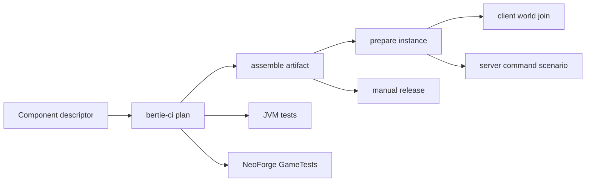

# bertie-ci

`bertie-ci` is the shared build and test interface for Bertie projects.
The command owns repeatable mechanics—Gradle invocation, fixtures, instance assembly,
process supervision, and result collection—while each project owns its suites and
assertions. GitHub Actions is an adapter, not the implementation.



Build, unit tests, GameTests, runtime tests, exports, and publishing remain separate
operations. They compose around explicit artifacts rather than rebuilding implicitly.

## Linux setup

From the Bertie monorepo:

```bash
nix develop
bertie-ci --help
nix flake check
```

Nix supplies the supported JDK, Gradle, packwiz, Python, Xvfb, HeadlessMC, and
`mc-runtime-test` versions. For a standalone repository, install the tagged package:

```bash
nix build 'github:bertie-mc/bertie?ref=bertie-ci/v5.0.0#bertie-ci' \
  --no-link --print-out-paths
```

Native Windows uses the same Python command with explicitly supplied dependencies; see
[the Windows guide](docs/windows.md).

## Component descriptors

A root [workspace descriptor](../../bertie-ci.toml) discovers component descriptors.
A separate repository can place the same component-format `bertie-ci.toml` at its root;
`bertie-ci` then treats it as a one-component workspace.

```toml
format = "bertie-ci.component.v1"
subject = "example-mod"
kind = "neoforge-mod"
gradle-project = ":mods:example-mod"
mod-id = "example_mod"
pack-metafile = "mods/example-mod.pw.toml"

[version]
file = "mod.properties"
key = "mod_version"

[[suite]]
id = "unit"
runner = "unit"

[[suite]]
id = "world-behavior"
runner = "gametest"

[[suite]]
id = "client-contract"
runner = "client"
fixtures = ["required-library"]
build-client-test-mod = true
require-log = ["EXAMPLE_CLIENT_ASSERTIONS_OK"]
```

Suites have stable names and select one modular runner:

- `unit` runs ordinary JVM tests.
- `gametest` runs registered NeoForge GameTests in the development server.
- `client` launches a production client and joins an integrated world. It can add a
  project-owned client test mod, required log markers, and a minimum discovered GameTest
  count.
- `server` launches a production dedicated server with a required project-owned
  HeadlessMC command-test JSON document. It may also require log markers.
- `validate` validates a packwiz manifest without changing it.

Runtime suite fields such as fixtures, timeout, memory, assertions, and command documents
belong to the component descriptor. `automatic = false` keeps an expensive suite out of
the affected-change plan while allowing scheduled and manual workflows to request it.

The descriptor's `build-client-test-mod` option is intentionally client-specific. A
server test artifact can still be supplied directly to the lower-level `server-test`
command or action; a future declarative server artifact will get its own explicit build
contract rather than reusing client terminology.

## Local commands

Build and JVM tests are deliberately separate:

```bash
bertie-ci build --workspace . --component carving \
  --output-dir .bertie-ci/artifacts
bertie-ci unit-test --workspace . --component carving
bertie-ci gametest --workspace . --component carving
```

`build` runs `assemble` and stages exactly one releasable JAR. `unit-test` runs
`test`. `gametest` runs `runGameTestServer`, requires at least one discovered test,
and checks the Minecraft log rather than trusting only the Gradle exit status.

Production client testing builds once, prepares a side-specific instance, and consumes
its relocatable descriptor:

```bash
bertie-ci build-client-test-mod --workspace . --component short-circuit-fix \
  --output-dir .bertie-ci/client-test
bertie-ci prepare-mod-instance --workspace . --component short-circuit-fix \
  --artifact .bertie-ci/artifacts/short-circuit-fix --fixture short-circuit \
  --side client --output-dir .bertie-ci/client
bertie-ci client-test --instance .bertie-ci/client/instance.json \
  --test-mod .bertie-ci/client-test/client-test-mod.jar \
  --require-log SHORT_CIRCUIT_RENDER_LAYERS_OK
```

The client runner uses HeadlessHQ `mc-runtime-test` for launch, world creation, player
join, timeout, and clean exit. On Linux, `bertie-ci` starts Xvfb directly, so no physical
display or desktop session is needed. Test NBT and other fixtures stay in the component's
test resources and never enter the release JAR.

A server suite supplies its own command scenario:

```bash
bertie-ci server-test --instance .bertie-ci/server/instance.json \
  --command-test tests/runtime/server-readiness.json
```

This keeps “ready” and future scenario assertions project-owned instead of hardcoding
them in the shared runner.

### Fixtures

`prepare-mod-instance` accepts canonical pack mod names or aggregate profiles:

```bash
bertie-ci prepare-mod-instance --workspace . --component forge-ink \
  --artifact .bertie-ci/artifacts/forge-ink \
  --fixture forbidden-arcanus,irons-spells \
  --side client --output-dir .bertie-ci/client
```

If `pack/mods/<name>.pw.toml` exists, the name resolves directly; one-to-one profiles are
unnecessary. [`fixtures/profiles.json`](fixtures/profiles.json) contains only useful
multi-mod dependency closures. The official packwiz installer applies the canonical
filename, hash, and physical side.

### Full packs

Pack preparation produces the same instance descriptor as mod preparation, so the
runtime commands make no assumption about which produced it:

```bash
bertie-ci pack-validate --workspace . --component pack
bertie-ci prepare-pack-instance --workspace . --component pack \
  --side client --output-dir .bertie-ci/pack-client
bertie-ci client-test --instance .bertie-ci/pack-client/instance.json \
  --max-memory 10G
```

`overlay-components` replaces released owned mods with current workspace artifacts in
an ephemeral pack instance. It reads each pack metafile and skips artifacts that do not
apply to the prepared instance's side.

## GitHub Actions adapters

Every job calls the shared setup action once. It installs Nix, builds the pinned command
environment once, and adds `bertie-ci` and Python to `PATH`; operational actions do not
re-evaluate Nixpkgs.

Tagged v5 actions live under:

- `bertie-mc/bertie/.github/actions/setup@bertie-ci/v5.0.0`
- `build-mod`, `unit-test`, `gametest`, and `build-client-test-mod`
- `prepare-mod-instance`, `prepare-pack-instance`, and `overlay-components`
- `client-test` and `server-test`
- `pack-validate`, `pack-export-client`, and `pack-export-server`
- `plan`, `release-plan`, and `github-release`

Reusable workflows in `.github/workflows` provide GitHub-specific jobs for standalone
repositories:

- `build-mod.yml`
- `unit-test.yml`
- `gametest.yml`
- `client-test.yml`
- `server-test.yml`
- `github-release.yml`

Each accepts the caller's component subject and reads that repository's descriptor.
Build workflows upload artifacts; test and release workflows consume them. Publishing
never rebuilds. Repositories retain their own triggers and job dependency graph.

## Releases

`release-plan` accepts only `subject/vX.Y.Z` and verifies the tag version against the
component's declared version. The monorepo release workflow then selects exactly one
path:

- a mod is assembled and its JAR is published;
- the pack's client and server exports are produced independently and published together;
- `bertie-ci` receives a source-only release used to version actions and reusable
  workflows.

Tests are not implicitly chained into release jobs. Releases are manual, and the
maintainer confirms the required pipelines for the exact commit before creating a signed
tag.

## Pins

The current toolchain is Minecraft 1.21.1, NeoForge 21.1.233, Gradle 8.14.4, Java 21,
HeadlessMC 2.10.0, `mc-runtime-test` 4.5.1, and packwiz-installer 0.5.14. Third-party
JARs are fixed-output Nix inputs with verified SHA-256 hashes. The canonical fixture pack
is the monorepo's `pack/` tree, built into the package by Nix.
